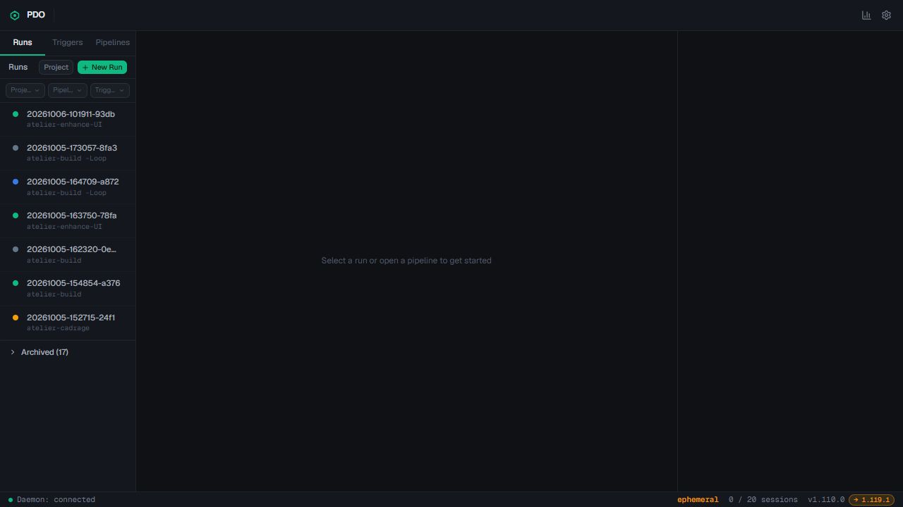
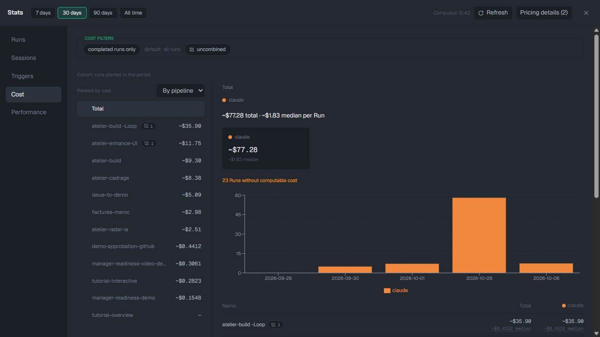
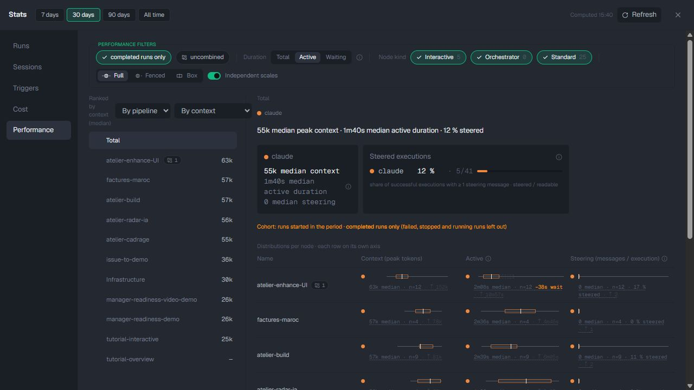
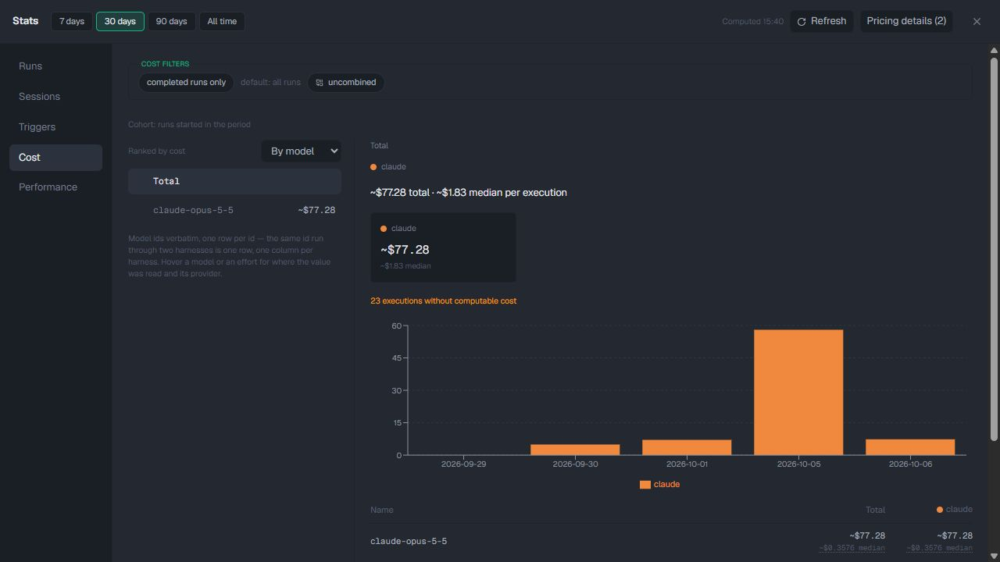
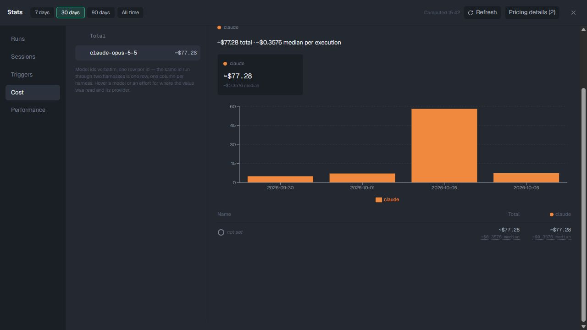
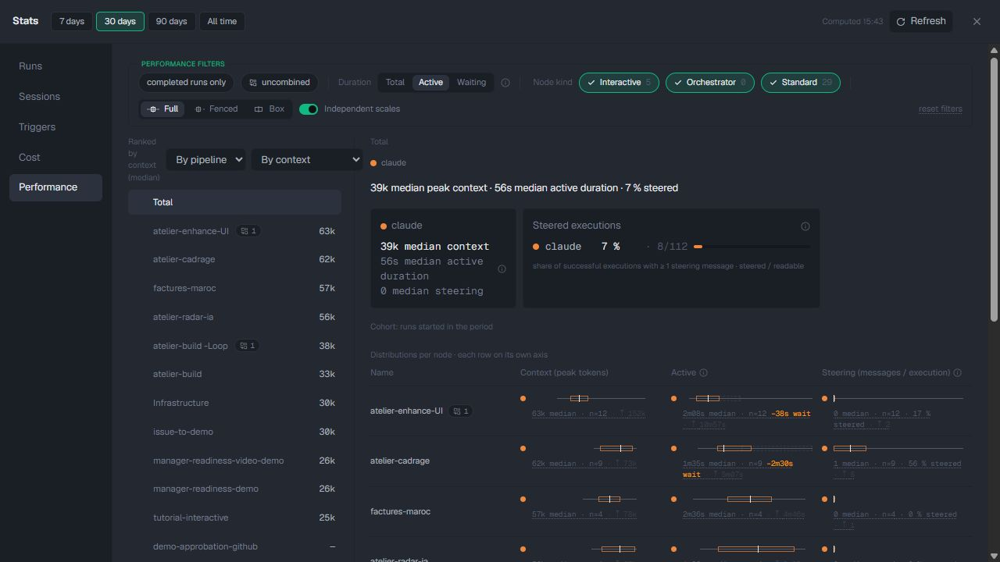
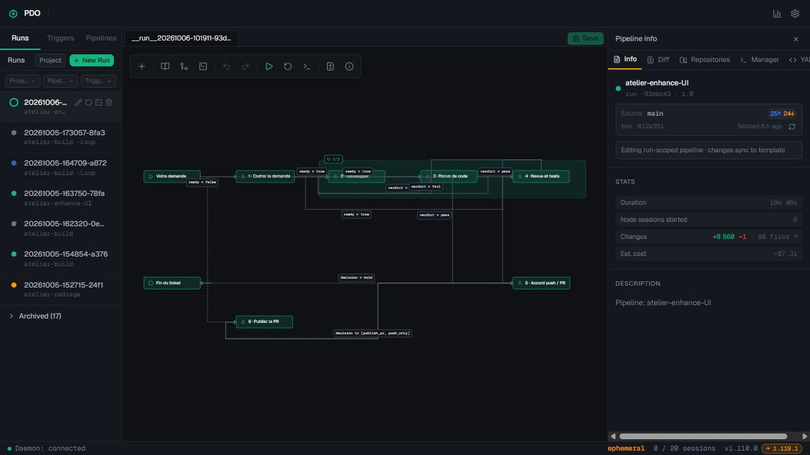
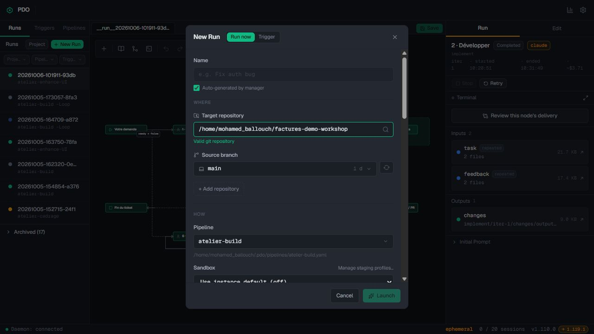

# Dashboard and analytics review evidence

The live review on 6 October 2026 examined PDO at `http://localhost:5172`, version `1.110.0`, with a 1280×720 browser viewport and the 30-day statistics period. The implementation plan targets fork version `1.119.1` at `5c8a6295967f7af824aeace31c8eb1ea72033d9c`. Screenshots below document the older live instance; they are not screenshots of the fork after a redesign.

Read the [implementation plan](dashboard-and-analytics.md) for priorities, metric definitions, dependencies, and acceptance criteria. [Concept images and provenance](../assets/dashboard-and-analytics/README.md) are separate from these live captures.

## Findings

| Finding | Evidence and scope | Recommended action |
| --- | --- | --- |
| Empty home workspace | The live landing screen has a large empty canvas and a small statistics icon. | Add a named dashboard with attention, activity and results. |
| Cost unit mismatch | The live model-axis Total headline shows ~$1.83 per execution, while its one model shows ~$0.3576 per execution. In fork `1.119.1`, `StatsCharts.tsx` still falls back to `cost.total` while choosing the execution label. | Reproduce against the target daemon and correct the unit/aggregation pairing. |
| Ambiguous cost coverage | ~$77.28 is displayed with “23 Runs without computable cost”; pricing explanations mention missing transcripts and infrastructure attribution. | Show complete, partial and unavailable coverage. Known spend in a partial run is not zero. |
| Different analysis populations | Cost opens on all runs; Performance opens on completed runs. The most expensive loop group appears in Performance only after disabling completed-only. | Expose consistent overview filters and explicit overrides. |
| Low contrast | The cohort label's computed style is 10.5px, RGB(82,90,104) on RGB(35,40,49): approximately 2.13:1. | Correct explanatory-text contrast and remeasure on `1.119.1`. |
| Dense performance controls | Independent scales, box-plot controls, and context metrics dominate the first view. | Lead with time, cost, outcome and sample size; retain advanced detail. |
| Launch and inspector hierarchy | The prompt is below the initial new-run viewport; the run inspector has horizontal overflow. | Bring essential inputs forward and improve responsive panel behavior. |

The source check concerns the inspected files, not a full runtime test of the fork. The current plan preserves existing functionality and asks implementation to verify behavior against its target version.

## Snapshot insights

- The combined **atelier-build -Loop** group contributes **~$35.90**, or **46.5%** of the displayed **~$77.28** total. The top three displayed groups contribute **~$56.95**, or **73.7%**. These shares use rounded recorded estimates and combined membership; they do not establish waste or savings.
- The inspected run shows **19m46s**, six node sessions, and **~$7.31**. Its implementation node shows **~$3.71**, approximately **50.8%** of the run estimate. Link spending to the node's actual work before judging efficiency.
- In the completed-run population, **atelier-cadrage** shows **4m54s median declared wait** and **1m28s median active duration** across four measured successful executions. Separate medians must not be added or turned into a percentage.
- Completed-only Performance shows **55k median peak context**, **1m40s median active time**, and **5/41 steered executions**. Including all run statuses changes these to **39k**, **56s**, and **8/112**. The population changed; this is not a performance improvement over time. Successful nodes can belong to a non-completed run.
- Only one model ID appears in the inspected cost list. The data cannot support a comparative “best model” claim.

The current period selects runs by their start time. Recorded spend within that run cohort is not necessarily spend incurred inside the same calendar period. No invoices, task acceptance, or cost-saving claims were independently validated.

## Live screenshots

### Landing screen

### Cost by pipeline

### Performance with completed runs selected

### Model total

### Individual model

### Performance with all run statuses

### Run details

### New run

