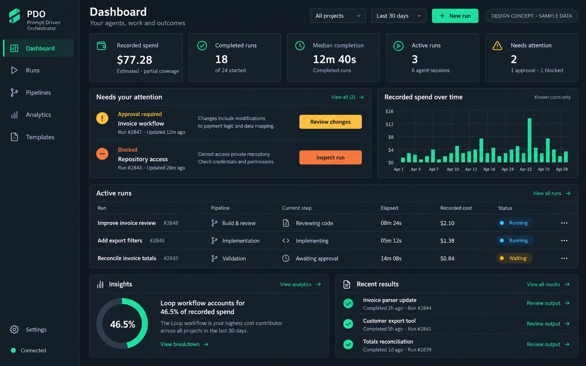
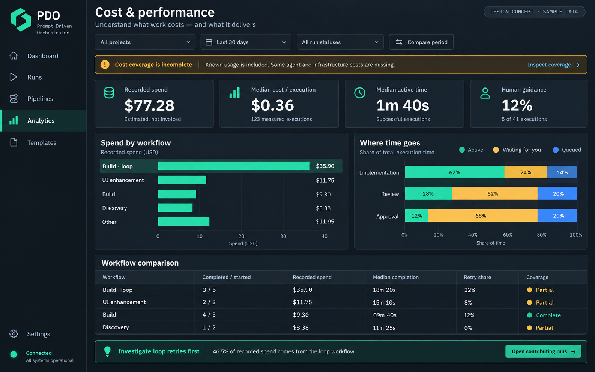

# Dashboard and analytics implementation plan

Add a dashboard that makes active work, decisions, results, spending, and performance visible when PDO opens. Build on the existing run, cost, and performance features, with accurate metric definitions and direct navigation to the work behind each number.

**Status:** proposed implementation plan; no application changes are included in this documentation update.  
**Date:** 6 October 2026.  
**Target:** [Mohamedballouch/prompt-driven-orchestrator](https://github.com/Mohamedballouch/prompt-driven-orchestrator), `main` at `5c8a6295967f7af824aeace31c8eb1ea72033d9c`, version `1.119.1`.  
**Evidence:** [live UI review and screenshots](dashboard-and-analytics-review.md), captured from version `1.110.0`. Source-level checks against `1.119.1` are distinguished from live observations.

## Goals

- Make the next useful action obvious: review an approval, inspect a blocked run, open a result, or start work.
- Explain recorded cost, its completeness, and the population behind every comparison.
- Show completion time, declared waiting, retries, and outcomes together without confusing runs with node executions.
- Improve readability and use of space while preserving the pipeline editor, terminals, reviews, triggers, and existing workflows.

The first release is a dashboard and analytics improvement for the existing local application. Native Windows execution, a new desktop wrapper, collaboration accounts, billing integration, and a backend rewrite are outside this plan. The browser UI can be used on Windows with the existing supported daemon environment; this work does not establish native Windows backend support.

## Design references

### Dashboard concept

The dashboard gives attention items and current work a prominent place, alongside recorded spend and recent results.

### Cost and performance concept

The analytics workspace brings cost coverage, workflow comparisons, time breakdowns, and contributing runs into one readable surface.

Both images are generated visual proposals with illustrative data, not implemented screens or telemetry fixtures. Use their hierarchy, spacing, and contrast as direction. Keep PDO's existing identity and theme system; do not copy invented logos, dates, run counts, percentages, or queue measurements into production. The images combine illustrative populations; implementation must use the metric contracts below. Keep Triggers accessible even though the concept rail omits it. “Templates” should open the existing pipeline library, not introduce a second template system. [Asset provenance and prompts](../assets/dashboard-and-analytics/README.md) accompany the images.

## Product structure

| Surface | Purpose | Main content |
| --- | --- | --- |
| Dashboard | Understand the current situation and take action | Attention queue, active runs, recorded spend, completed work, recent results |
| Runs | Operate and inspect work | Existing run list, canvas, node details, manager, outputs and review |
| Pipelines | Design and reuse workflows | Existing editor, library, validation and launch entry points |
| Triggers | Manage automatic launches | Existing schedules, guards, status and history |
| Analytics | Investigate cost and performance | Overview, cost, performance, sessions and trigger history |
| Settings | Configure the instance | Existing settings and connections |

Dashboard becomes the default for a fresh visit without a specific run or review target. Explicit review URLs and existing run selections continue to work. Moving between Dashboard, Analytics, and the editor must preserve open tabs, selections, unsaved edits, and terminal sessions. Use existing navigation state first; a routing framework migration is not a prerequisite.

### Dashboard content

1. **Header:** project selector, visible reporting period, refresh state, and New run.
2. **Summary:** recorded estimated spend with coverage; completed runs with denominator; median run completion time; live runs; attention count.
3. **Attention:** waiting for user, blocked, or failed items with a reason, age, and an action that opens the correct run or node. Inspection must not approve, retry, resume, or publish work.
4. **Active work:** descriptive name, pipeline, current step or parallel-step count, elapsed time, available cost, and textual status.
5. **Spend trend:** continuous calendar axis with explicit USD units. Distinguish no activity, unknown values, and days outside the data window.
6. **Recent results:** completed work, available outputs, review state where recorded, and Open result or Review changes.
7. **Insights:** a small ranked set of observations with scope, evidence, and an Open contributing runs action.

Historical summary cards follow the selected period and project. Live runs and attention items use the project filter but remain explicitly labeled **Live now**, so an old reporting period cannot hide a current decision. The header must make this distinction visible.

### Analytics content

Use a shared project, period, and run-status scope for the new overview. Detailed sections may apply a different population, but must show that override and its included/excluded counts. Existing Stats currently uses independent, ephemeral per-tab settings; changing that behavior requires a documented decision and regression coverage.

Lead with understandable measures and a workflow table. Keep context distributions, box plots, model/effort provenance, combined groups, and advanced controls available in detail views. Use shared axes for cross-row comparisons by default. Expose combined pipeline membership and avoid counting members a second time.

Navigation from a chart or insight must retain its filters and open the underlying runs, executions, or outputs. A small sample should show its sample size; do not label a model “best” from one model or unlike tasks.

## Metric contracts

The backend should return the value with its unit, population, sample count, coverage, and computation timestamp. Use additive fields or a dedicated overview response as needed; existing consumers must remain compatible.

| Metric | Definition and display rule |
| --- | --- |
| Recorded estimated spend | Sum of attributable known cost contributions in the selected run cohort, counted once across combined groups and parent/child relationships. Show partial coverage. Never substitute zero for unknown cost or describe usage estimates as invoices. |
| Cost coverage | Separate complete, partial, and unavailable runs using contribution-level evidence. A partially readable run can contribute known spend while remaining incomplete. Do not infer this split from a single aggregate `unknown` count. |
| Median cost per run | Median of eligible readable run totals. Display the run sample and completeness policy. Never relabel it per execution when grouping changes. |
| Median cost per execution | Median of readable execution cost samples. Compute from samples or an appropriate distribution, not from a mean or median of group medians. |
| Completion rate | Completed runs divided by eligible terminal runs; list failed, stopped, skipped, running and waiting counts separately. Define the terminal-status mapping from the domain model. Show `—` for an empty denominator. A completed run is not necessarily an accepted deliverable. |
| Median completion time | End-to-end wall time from run start to completion for completed runs in scope. Show count and, when sufficient data exists, p95. Never sum parallel node durations to estimate run wall time. |
| Active and waiting time | Preserve the current definition: node wall time minus declared waits, and declared waits themselves. Missing wait instrumentation is not proof of zero human delay. Separate medians are not additive. |
| Human guidance | Share of readable successful executions with at least one qualifying steering message. Preserve exclusions for launch prompts and runtime messages. Guidance is a collaboration signal, not automatically a failure. |
| Retry and loop cost | Attribute spend to execution attempts and iterations, distinguish expected loops from corrective retries, and link each amount to its events. Counts of node starts alone do not establish retry waste. |
| Cost per completed outcome | For a linked attempt cohort, known spend across the eligible attempts divided by completed outcomes; show coverage and outcome definition. Defer if attempts cannot be reliably linked. Explicit acceptance needs an acceptance event, not a completion label. |

Initially retain the documented **runs started in the period** cohort. A future **spend incurred in the period** view requires timestamped cost attribution and a distinct label. Specify timezone and bucket boundaries together, using half-open intervals and consistent server/client conversions. Period comparisons must use equal windows, the same filters, and visible sample sizes.

No queue-time chart, spend forecast, accepted-output score, or savings percentage should ship until its source data and calculation exist. The queue segments in the concept are illustrative. Render unavailable measures as unavailable or omit them with a clear explanation.

## Existing implementation and data gaps

| Area | Reuse or extend | Constraint |
| --- | --- | --- |
| App navigation | [App.tsx](../../frontend/src/App.tsx), [main.tsx](../../frontend/src/main.tsx), [UnifiedLeftPanel.tsx](../../frontend/src/components/UnifiedLeftPanel.tsx) | Navigation is mainly state-based; preserve review URLs and editor lifecycle. |
| Statistics UI | [StatsModal.tsx](../../frontend/src/components/StatsModal.tsx), [StatsCharts.tsx](../../frontend/src/components/StatsCharts.tsx), [statsFilters.ts](../../frontend/src/lib/statsFilters.ts) | Reuse existing detail views and distribution handling; document changed filter defaults. |
| Data loading | [useStats.ts](../../frontend/src/hooks/useStats.ts), [api.ts](../../frontend/src/api.ts), [types.ts](../../frontend/src/types.ts) | Existing `/stats/overview`, `/stats/cost`, `/stats/performance` responses have different costs and populations. |
| Backend aggregation | [stats.rs](../../crates/pdo-daemon/src/stats.rs), [stats_performance.rs](../../crates/pdo-daemon/src/stats_performance.rs), [run_cost.rs](../../crates/pdo-daemon/src/run_cost.rs) | Extend the owner of the calculation; keep cost provenance and memoization. |
| Live state | [useDaemonSocket.ts](../../frontend/src/hooks/useDaemonSocket.ts) and existing run/session APIs | Live activity must distinguish nodes from manager/infrastructure sessions and stale connections. |
| Run and launch flow | [PipelineInfoPanel.tsx](../../frontend/src/components/PipelineInfoPanel.tsx), [NodeDetailPanel.tsx](../../frontend/src/components/NodeDetailPanel.tsx), [NewRunModal.tsx](../../frontend/src/components/NewRunModal.tsx) | Retain explicit mutation controls and existing validations. |
| Appearance | [index.css](../../frontend/src/index.css), existing UI primitives and theme hooks | Support current light, dark, and system themes; do not hardcode the concept palette throughout components. |

The current overview payload exposes counts and session/trigger groupings, not a ready-made dashboard response with every desired metric. Project/status filtering, completion distributions, complete/partial/unavailable coverage, and a bounded attention list must be verified or added at the aggregation boundary. Do not download every transcript or fetch every run detail just to render the home screen.

Show light summary data first. Load memoized cost/performance data independently, retaining timestamps and explicit loading, stale, empty, and error states. A socket event should invalidate or refresh the necessary summary without triggering expensive rescans for every terminal output event. Keep heavy computation off the rendering path and reuse existing request cancellation/stale-response handling.

Follow the [module layout rule](../agents/module-layout.md): extend the existing owner of each concern, keep daemon modules as siblings, and justify any new dashboard component or baseline change. Do not introduce a parallel analytics stack or bypass the layout ratchet.

## Delivery phases

### Phase 1 Establish trustworthy metrics

- Reproduce the run/execution cost-label issue on the target version. The inspected `1.119.1` source still chooses `cost.total` for model-axis Total while choosing an execution label.
- Correct aggregation/unit pairing and add fixtures with multiple models, unequal sample sizes, partial infrastructure cost, and zero observations.
- Define coverage states and the dashboard population contract; reconcile this with existing CONTEXT and ADR rules during implementation.
- Improve explanatory-text contrast and replace status-only color cues with text or shape.

**Acceptance:** switching grouping never changes a value's unit without changing the underlying population; all medians reconcile with their samples; partial data is visible; informative normal-size text meets 4.5:1 contrast. Advanced statistics remain usable.

### Phase 2 Add the dashboard

- Add a named Dashboard destination and fresh-visit entry behavior.
- Build the summary, live attention list, active runs, and recent results from bounded existing or extended APIs.
- Connect each card and row to a meaningful detail destination.
- Preserve specific run/review entry points, editor state, and terminal lifecycle across navigation.

**Acceptance:** empty, populated, loading, disconnected, stale, and error states are understandable; one failed analytics request does not blank the app; opening the dashboard does not launch or modify work. All visible counts match their documented scope.

### Phase 3 Improve cost and performance analysis

- Add the shared overview filters, with visible detail-level population overrides.
- Present recorded spend, coverage, comparable workflow rows, and active/waiting analysis before advanced distributions.
- Add calendar-continuous charts, clear units, sample sizes, and source-record drill-downs.
- Keep model/effort views, combined-group inspection, and existing session/trigger analytics accessible.

**Acceptance:** chart and table totals reconcile within displayed rounding; filters produce consistent results; combined groups do not double-count; all group changes retain correct units; unknown values remain distinct from zero.

### Phase 4 Improve the surrounding workflows

- Use descriptive run names with identifiers as secondary text and a useful fallback when no title exists.
- Place repository, pipeline, and task prompt together in the launch form; collapse advanced configuration and keep validation and Launch visible.
- Add a stable run summary and clear output-review action; keep detailed node/terminal inspection available.
- Remove accidental inspector overflow and keep keyboard focus and control labels clear.

**Acceptance:** primary run and launch flows work at 1280×720 and 1440×900, with usable zoom and keyboard navigation. Advanced options, triggers, and read-only run behavior continue to work.

### Phase 5 Add evidence based insights

- Start with deterministic cost concentration, missing coverage, and declared-wait observations using available data.
- Add retry attribution, comparable-period regressions, and user-configured budgets only when the required data is present.
- Include the period, project, population, sample size, explanation, and contributing records for each insight.

**Acceptance:** every insight can be reproduced from its source records; small or incomparable samples do not produce unsupported rankings; no automatic corrective action accompanies an observation.

## Implementation backlog

These are local planning references, not created GitHub issues. Split them into the project's normal issue/branch workflow when implementation begins.

| Reference | Deliverable | Depends on | Completion evidence |
| --- | --- | --- | --- |
| UI01 | Population and metric definitions | None | Documented units, status mapping, boundaries and source fields |
| UI02 | Cost unit and coverage corrections | UI01 | Regression cases for Total, model, pipeline and partial attribution |
| UI03 | Readability and status labels | None | Theme contrast checks and keyboard inspection |
| UI04 | Dashboard summary and attention data | UI01, UI02 | Bounded queries, coverage metadata, stale/error behavior |
| UI05 | Dashboard navigation and layout | UI03, UI04 | Empty/populated screenshots and preserved editor state |
| UI06 | Analytics overview and shared filters | UI01, UI02, UI03 | Scope displayed; filter and grouping tests pass |
| UI07 | Analytics drill-down and time comparisons | UI06 | Source records reconcile with each chart/table |
| UI08 | Run summary and launch form | UI03, UI05 | Launch validation, review links and read-only behavior verified |
| UI09 | Deterministic insight cards | UI04, UI07 | Fixtures reproduce each statement and its contributing records |
| UI10 | Delivery review and documentation | UI05–UI09 | Required checks, visual review, updated help and release notes |

The first useful release is UI01–UI05. Follow with analytics and workflow changes in separately reviewable increments. UI09 can begin with available coverage and concentration insights; richer outcomes and budgets can follow later without delaying the dashboard.

## Validation and release

- **Metrics:** exercise complete, partial, unknown and empty costs; mismatched run/execution sample counts; multiple models; combined groups; parent/child attribution; overlapping intervals; date boundaries; completed nodes inside non-completed runs.
- **Frontend behavior:** filter state, failed requests, stale responses, refresh, navigation, attention links, and preserved editor/terminal state. Extend the existing Stats, filter, and navigation tests rather than duplicating internal implementation assertions.
- **End to end:** use the existing [Playwright configuration](../../frontend/playwright.config.ts) with its isolated daemon and harness stubs. Cover Dashboard → run → output/review → Analytics, plus launch validation and a disconnected state. Do not use the user's active runs as fixtures.
- **Visual and accessibility:** compare populated/empty/error screenshots at 1280×720 and 1440×900; check light/dark themes, 200% text zoom/reflow, keyboard order, visible focus, status labels, and tooltips. Use [WCAG contrast](https://www.w3.org/WAI/WCAG22/Understanding/contrast-minimum.html) and [use of color](https://www.w3.org/WAI/WCAG22/Understanding/use-of-color.html) criteria.
- **Repository gate:** run `make check` before moving `main`, as required by the [project Git flow](../agents/git-flow.md). Run affected frontend/Rust checks and relevant end-to-end cases for changed behavior. Broad `make test` and HP runs follow that document's opt-in policy. The current Makefile and real-daemon end-to-end tests require a supported Unix environment such as WSL; documentation editing requires neither.
- **Rollout:** ship correct metric contracts before dashboard promotion; retain existing detail destinations during the transition; update tours/help as navigation changes. Keep API additions compatible so the dashboard surface can be reverted without a data migration.

For this documentation-only change, validate relative links, embedded assets, file integrity and whitespace. Application tests are not needed until implementation changes application behavior.

## Open implementation decisions

Resolve these in Phase 1 using the existing domain rules and measured API behavior:

- Whether the bounded dashboard response should extend `/stats/overview` or use a dedicated read-only endpoint, including server-side project/status filters.
- The exact terminal-status denominator and the distinction between completed work, accepted output, and skipped runs.
- Whether existing event timestamps support queue measurements and linked attempts; omit those views until they do.
- How the new shared overview scope relates to the existing ephemeral per-tab Stats contract. Record intentional changes instead of silently adding persistent filters.

The target fork uses `main` as its integration branch under the project-specific Git flow override; do not introduce a `develop` dependency for this work.
